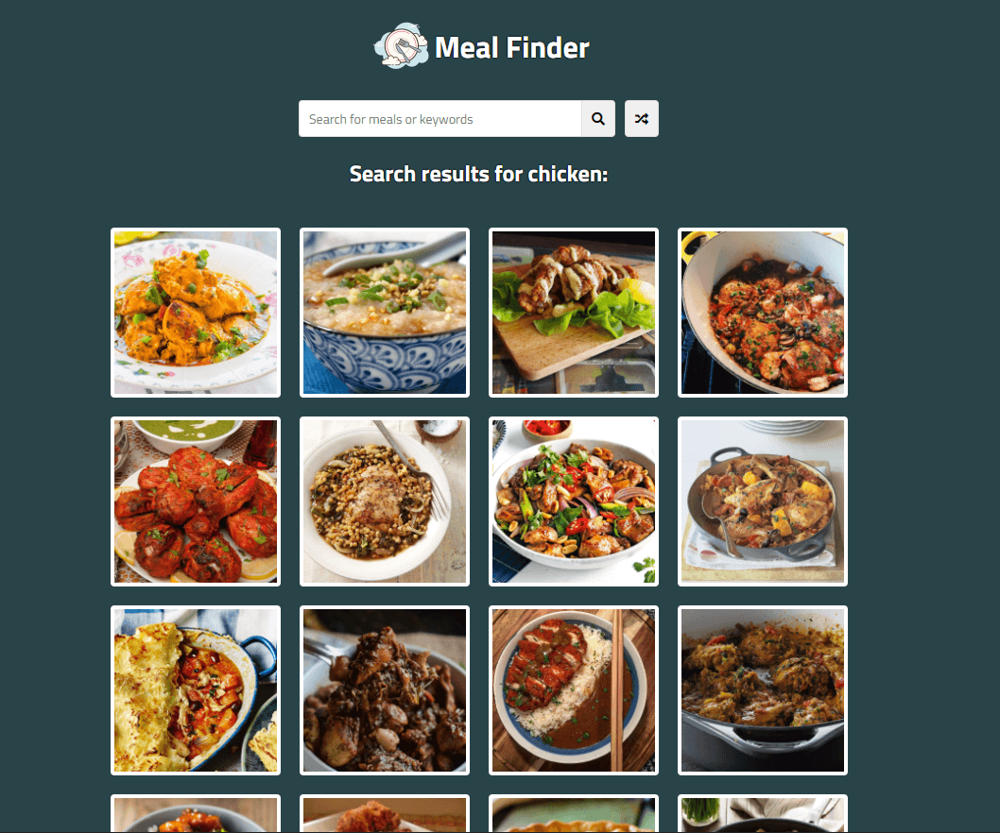

# Meal Finder App

> Search and generate random meals from the [themealdb.com](www.themealdb.com) API

### [Demo](http://meal-finder-ab.surge.sh)
[](https://radikal.ru/video/oarsxEbLJEv)

### Get started

```shell script
git clone
```
```shell script
open index.html
```
or
```shell script
npm i -g live-server
```
```shell script
live-server
```
